# TaskFlow 📱💻🌐

**Кроссплатформенное приложение для управления задачами**  
(Flutter + Firebase для iOS, Android и Web)

[](https://flutter.dev)
[](https://firebase.google.com)
[](https://flutter.dev/multi-platform)

## 🔥 **Функционал**
✅ **Управление задачами**: создание, редактирование, удаление, завершение, возобновление.  
✅ **Гибкие напоминания**: за 15 мин, 30 мин, час, 6 часов, 12 часов, день, 3 дня, неделю, месяц.  
✅ **Фильтры и сортировка**. 
✅ **Авторизация** через Firebase (Email/Google).  
✅ **Push-уведомления**.  
✅ **Адаптивный дизайн** для всех устройств.  
✅ **Темная/светлая тема**.  
✅ **Мультиязычность** (поддержка переключения языков).

## 🛠 **Технологии**
- **Flutter** (с поддержкой всех платформ).
- **Firebase**:
    - Auth (авторизация).
    - RealtimeDatabase (база данных).
- **Паттерны**: Provider.
- **Интернационализация**: `l10n`.

## 📸 **Скриншоты**

### 🔐 **Авторизация и настройки**
| Регистрация | Вход |
|-------------|------|
| 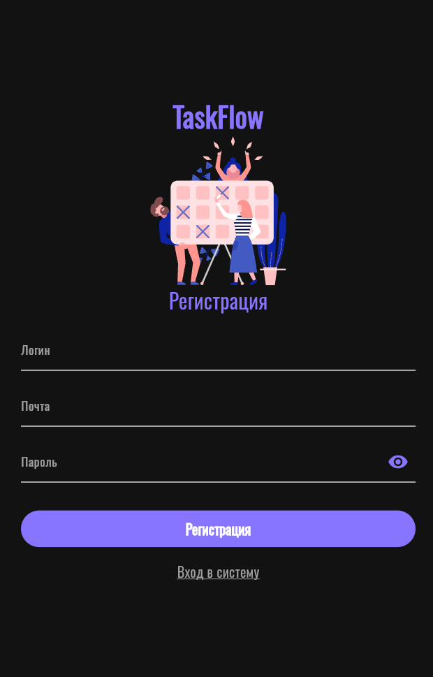 | 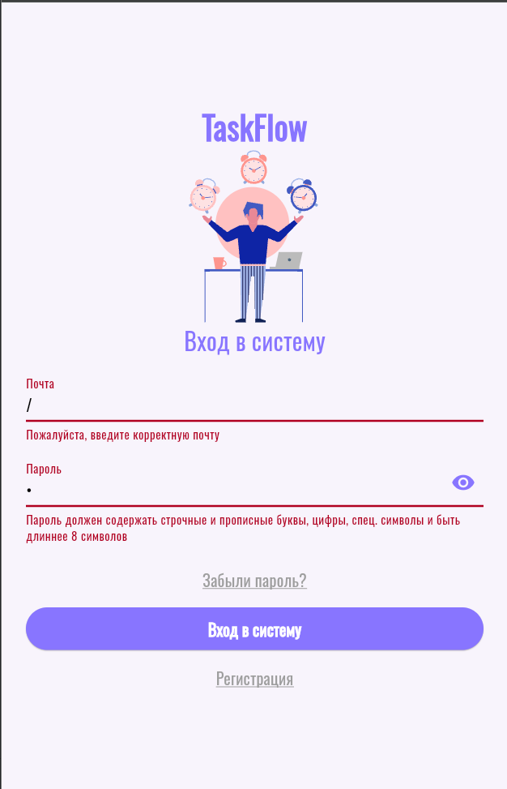 |
| **Сброс пароля** | **Настройки** |
| 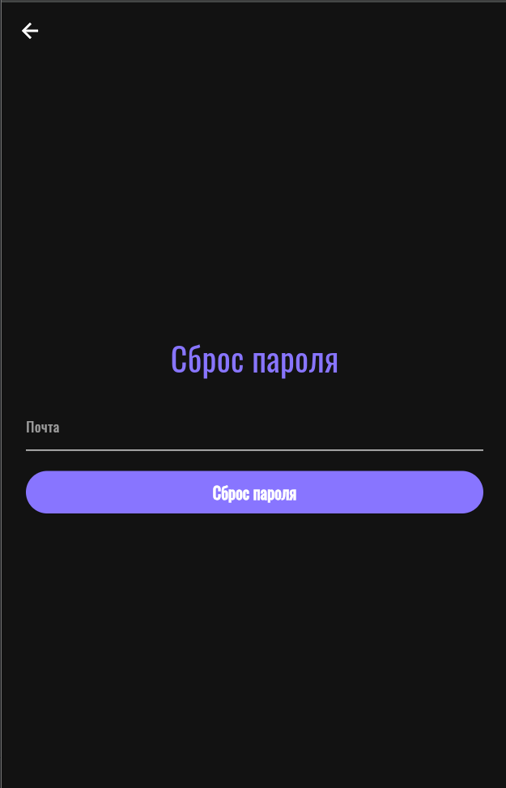 | 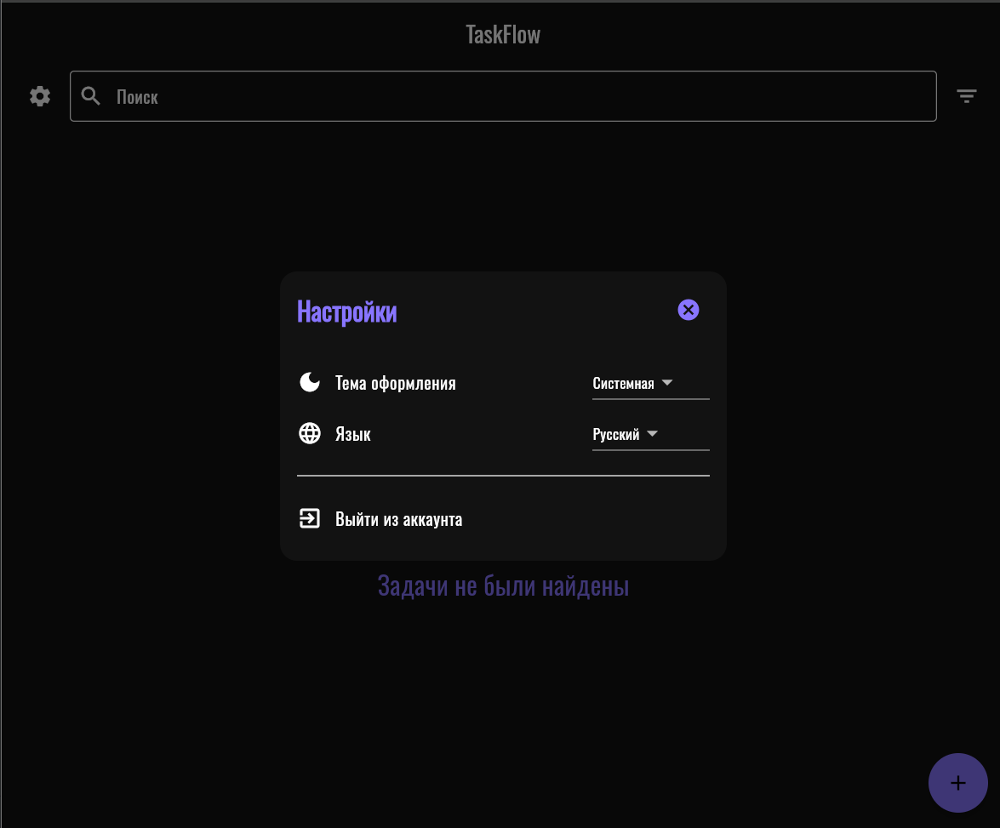 |

### 📋 **Управление задачами**
| Фильтры | Пустой список |
|---------|---------------|
| 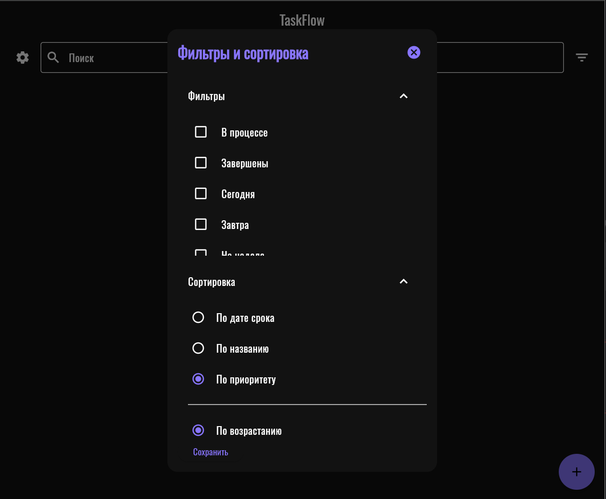 | 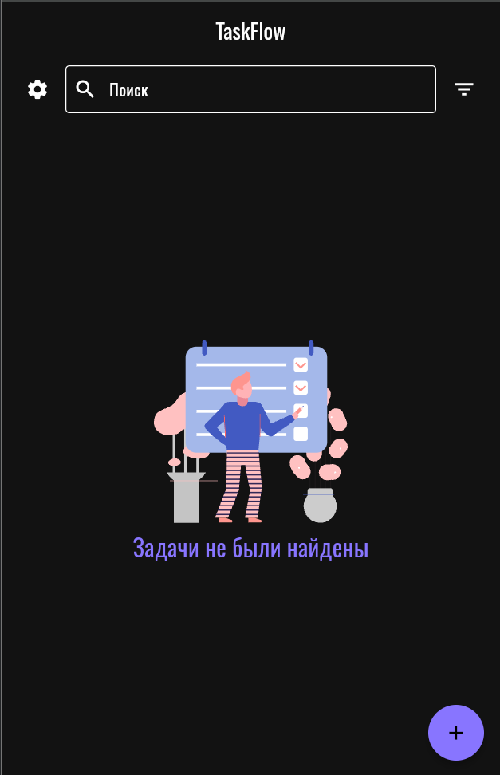 |
| **Создание задачи** | **Напоминания** |
| 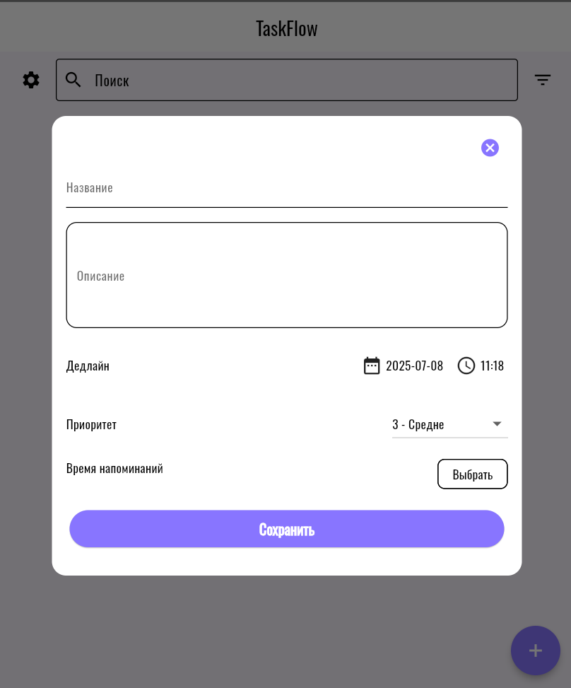 | 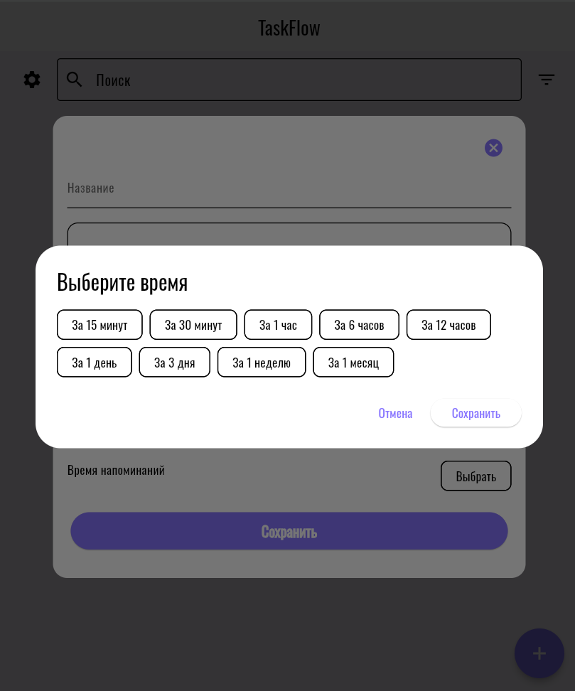 |

### 📱 **Адаптивный интерфейс**
| Мобильный вид                                                                               | Планшет/Десктоп |
|---------------------------------------------------------------------------------------------|------------------|
| 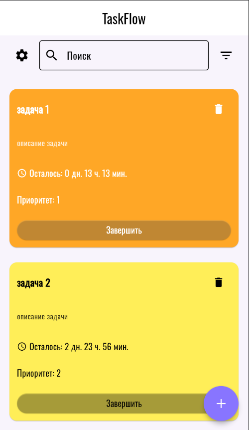 | 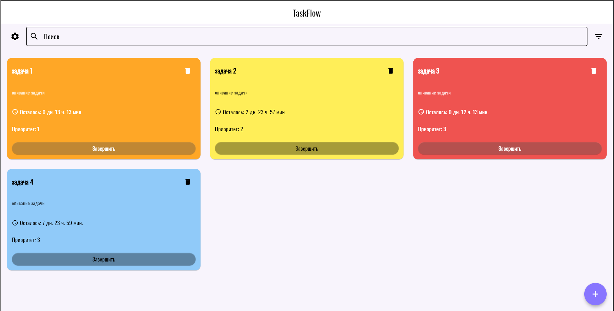 |
| **Запись задачи**                                                                           | **Компактный список** |
| 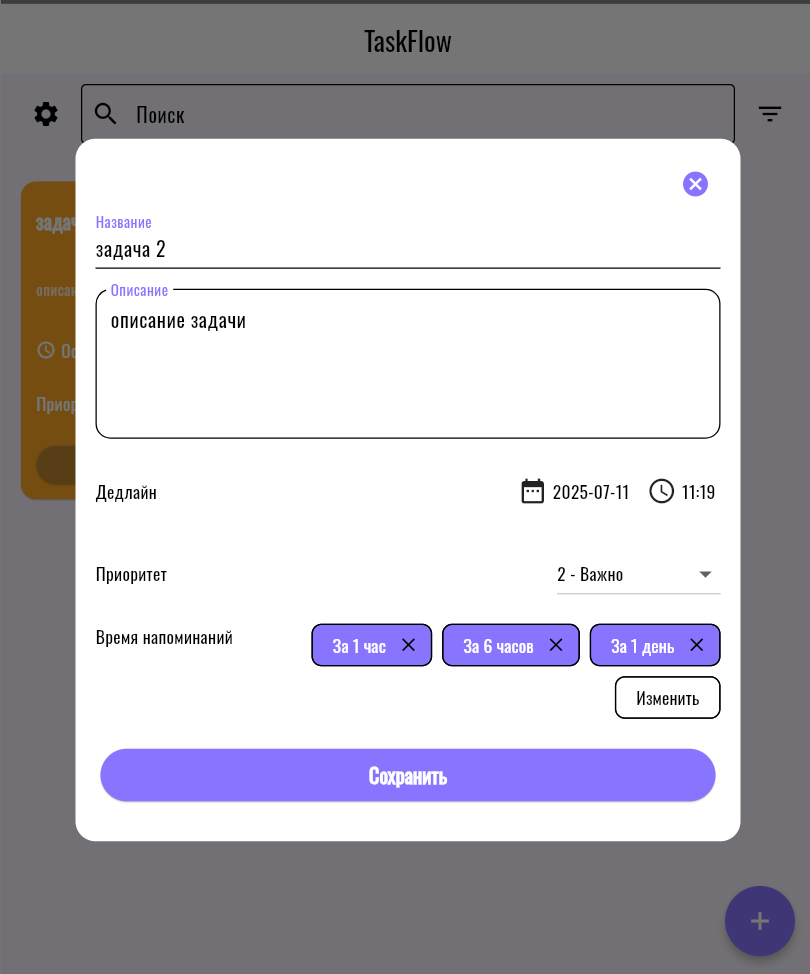                         | 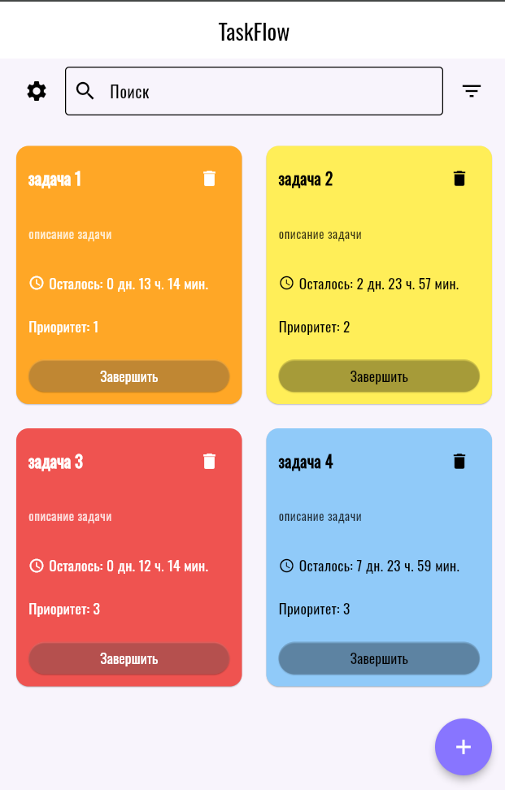 |

## 🚀 **Как запустить?**
1. **Клонируй репозиторий**:
   ```bash
   git clone https://github.com/darkhamu/TaskFlow.git